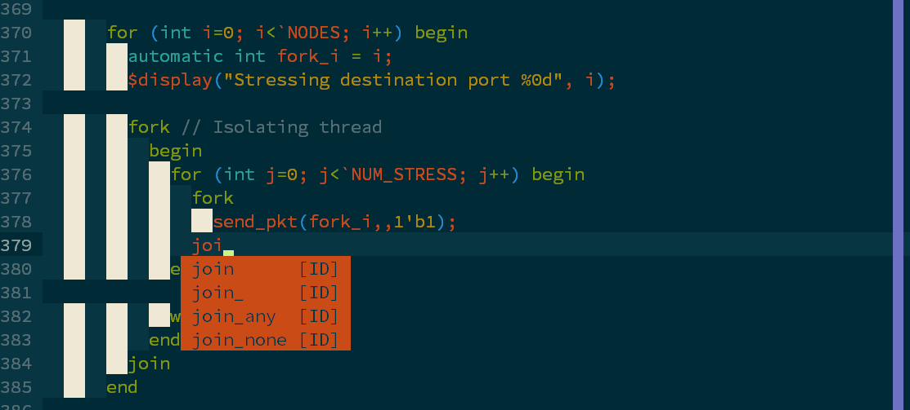

# 18-341 Configuration Files

This is a collection of bash utilities and editor plugins put together by the
staff of 18-240. It is by no means exhaustive, but we hope that students will
find this to be a nice and feature-rich baseline. If you would like to suggest
another utility or plugin to be added, please feel free to email the course
staff.

## Getting Started



### Prerequisites (Windows)

Full installation becomes a more complicated if you use a terminal emulator. If
you have any questions, please see a TA during office hours...

### Prerequisites (Linux)

* Development tools and CMAKE: `apt install build-essential cmake`
* Python Headers: `apt install python-dev python3-dev`
* (Symantic support for C-family languages): `apt install clang`
* CTags: `apt install exuberant-ctags`
* ViM >= 7.4.1578

### Installing

1. Clone the repository from ECE Gitlab

```
git clone --recursive https://github.com/daniel-stiffler/awesome-rc.git
```

2. Make necessary backups of your personal configuration files

3. Copy dot-files and dot-dirs to your home (`$HOME`) directory

```
cd awesome-rc

cp -r .vim ~/.vim
cp .vimrc ~/.vimrc

cp .bashrc ~/.bashrc
cp .bash_aliases ~/.bash_aliases
cp .dircolors ~/.dircolors
```

4. (Optional) Copy bash utilities to your home (`$HOME`) directory

```
cd awesome-rc

cp -r fzf ~/fzf
cp .fzf.bash ~/.fzf.bash

cp -r liquidprompt ~/liquidprompt

cp -r enhancd ~/enhancd
```

## Bash Utilities

* [enhancd](https://github.com/b4b4r07/enhancd)
* [liquidprompt](https://github.com/nojhan/liquidprompt)
* [fzf](https://github.com/junegunn/fzf)

## Editor Utilities

* [Vundle](https://github.com/VundleVim/Vundle.vim)
* [Fugitive](https://github.com/tpope/vim-fugitive)
* [NERD Tree](https://github.com/scrooloose/nerdtree)
* [Syntastic](https://github.com/scrooloose/syntastic)
* [Surround](https://github.com/tpope/vim-surround)
* [CTRL-P](https://github.com/kien/ctrlp.vim)
* [ViM Colors Solarized](https://github.com/altercation/vim-colors-solarized)
* [ViM Airline](https://github.com/bling/vim-airline)
* [Tagbar](https://github.com/majutshushi/tagbar)
* [NERD Commenter](https://github.com/scrooloose/nerdcommenter)
* [Git Gutter](https://github.com/airblade/vim-gitgutter)
* [YouCompleteMe](https://github.com/valloric/youcompleteme)
* [ViM Airline Themes](https://github.com/vim-airline/vim-airline-themes)
* [Indent Guides](https://github.com/nathanaelkane/vim-indent-guides)
* [Markdown](https://github.com/plasticboy/vim-markdown)
* [NumberToggle](https://github.com/jeffkreeftmeijer/vim-numbertoggle)
* [Systemverilog](https://github.com/nachumk/systemverilog.vim)
* [ReStructured Text](https://github.com/Rykka/riv.vim)

## Contributing

* **Daniel Stiffler** - *Initial Work* - [dstiffle](https://github.com/daniel-stiffler/)
